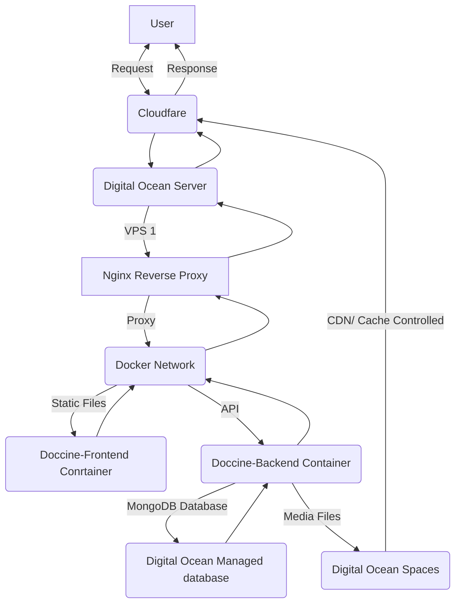

<h1>
   Kamaldhari  Infotech 
</h1>

Date: 1st June 2022
Subject: Brief Report of Doccine.

## 1. Doccine Backup System

 To Understand and Plan a Backup Stratergy we Must look at the current architecture of doccine. All the Services are Hosted in Digital Ocean in the region of India Banglore and Singapore. 
List of the Services are as follows:

a. Droplet (VPS) .
b. Managed MongoDB Database.
c. Digital Ocean Spaces.

Graph

#### a. Digital Ocean Droplet (VPS)

Digital Ocean Droplet is A VPS(Virtual Private Server) in Running Ubuntu 20.04.

- VPS Specs:
	 - CPU: 1 cpu
	 - Ram: 1GB
	 - Storage: 25G
	 - OS: Ubuntu 20.04 
<ol type="I">
 <li>Features of VPS</li>
<ul>
<li> Easily Resizeable </li>
<li> Deployable in minutes </li>
<li> Weekly Backups </li>
<li> Easy Snapshot </li>
</ul>
 <li> Software Running On Server</li>
 <ul>
<li> Docker</li>
<li> Nginx</li>
<li> openssh</li>
<li> fail2ban</li>
<li> watchdog</li>
<li> ufw</li>
<li> zero-tier one</li>
</ul>
</ol>

#### b.  Managed MongoDB Database.

- Database Specs:
	- CPU: 1 
	- RAM: 2 GB
	- Storage: 34 GB
<ol type="I">
 <li>Features of Managed Database</li>
<ul>
<li> Daily point-in-time backups </li>
<li> High availability with automated failover </li>
<li> End-to-end security </li>
<li> Cluster metrics and alerting </li>
<li>Zero Downtime </li>
</ul>
<li> Backup Features </li>
<ul>
<li>Point-In-time backup upto 7 days </li>
<li>One Click Restore</li>
<li>Easy Fork Database without Downtime</li>
</ul>
</ol>

#### c.  Digital Ocean Spaces.

Digital Ocean Spaces is equivilent to AWS S3 bucket. IT is S3 API Comptible. All the Media of App Doccine IS stored in S3 and then Served to the Users using cloudlfare CDN. 

As, Per the Doccine Architecture, Many of the services of Digital Ocean Provides Easy Backup and Restore Functionality. Apart for that, A Custom Database backup tool will be setup to backup the full database on daily basis and upload it to Digitalocean Spaces with the plan of 30 days Retention Policy.

Other Services that are not Included in Digital Oceans that Helps run and the doccine service are:

1. Gitlab Server
2. Gitlab Registry
3. Github
4. Docker hub
5. On Premises NAS Backup

The Code of doccine is Currenly hosted on Our Gitlab Server (gitlab.webcase.me) and the code is backed up to 2 different Services i.e github and NAS. Gitlab Server periodically push all the changes, update to the kamaldhari Github repository. Gitlab Server Itself is daily backed up to our On Premises NAS with **7 Days Retention** of Full Restoration.

To Understand the Part of Gitlab Registry and Docker hub in Doccine we much look at the current flow.

git flow:
Dev -> Gitlab -> Ci/Cd -> deployment

Ci/Cd Flow:
Commit -> Build -> Lint test -> Package & Upload -> Deploy

Once A feature is Developed and Tested in local. It is then Pushed to Staging branch which triggers the a "Pipeline" Which automatically Builds and Deploy that code to  staging enviroment if the code passes the QA. Then the code is pushed to Production Branch marking as Release.

The Pipeline Has 3 Stages 
 - Build
 - Package (Dockerize)
 - Deploy
 
 ![[Pasted image 20220602132133.png]]

At the beginning of the pipeline, the build stage is triggered. In which
the code is compiled and tested with the correct enviroment variables. once Successfull, it then proceed to the next stage which is Package. 

In Package Stage. The build code is packaged into a Docker container(REF Image) with all the tools required to run that code with correct settings and that packaged *image* is then pushed to The *Registry* for Storage and Deployment. 

Once the Image is Build, In deploy stage. A script then run on the server which *pulls/Download* the Image and Start Running the doccine Services.

![[Pasted image 20220602132901.png]]

ALL the Images are Stored In Gitlab Registry for 2 Week. In case the Gitlab Registry Goes Down all the Production Images are Also Stored Docker Hub for Easy Deployment and Always Available.

## Conclusion 
The Doccine architecture/Flow is Desigened in such a way that it provide Great redundancy. Many of the Services are backed by other **ALWAYS ON** Services allowing flexibility and reliability

#### scenarios
Q. What If Gitlab Server where the dev are working goes down?
A. In case the Gitlab Server goes down, developers can Quickly Switch to the Github Repository and continue their work. Once the Gitlab Server is Live again the code will be synced.

Q. What If is the Gitlab Registry where the Docker Images are Hosted goes down?
A. In that case, Automatic Deployment will be effect but can the Production enviroment will now be affected.

Q. What if Gitlab Registry is down and we need to rollback a Production Deployment?
A. Even if the Gitlab Registry Goes down, A rollback is still possible and A copy of Production Images are Also Pushed to Docker Hub which is always on service allowing and easy Rollback.

Q. What if the Production Server Gets Corrupted and is No longer Functional?
A. In the following event, A new Server will be Deployed and setup quickly which will be used to host those docker Images.

Q. What if the Production Server is unable to handle the traffic?
A. because of Docker and Docker Images, The architecture will easily scale horizontally on to multiple servers Increasing the capacity. A Vertical Approch (Resizing VPS) is also Available and will be much faster and easier.

Q. What if the Production Database goes Offine?
A. The Production Database is managed by Digital Ocean in **Cluster Mode** which Ensures ZERO DOWNTIME. 

Q. What if the Production Database Gets Corrupted?
A. Digital Ocean provide Point-In-Time Restore Either to Seperate Server (FORK DATABASE) or On same Server (Normal Resore) Ensuring Fast and easy Restoration.

